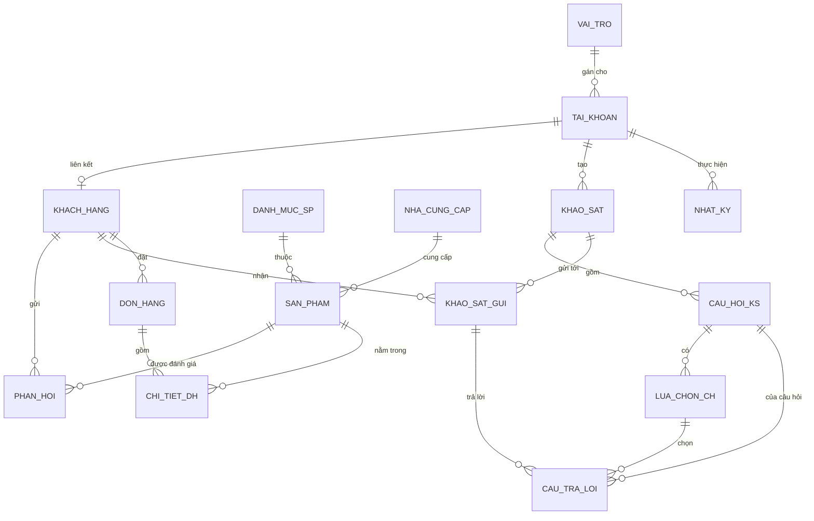

# THIẾT KẾ CƠ SỞ DỮ LIỆU HỆ THỐNG CRM — KATINAT COFFEE

**Công nghệ đề xuất:** MySQL (qua XAMPP) + PHP/Java (OOP) + HTML/CSS/JS
**Charset khuyến nghị:** `utf8mb4_unicode_ci`, Engine: `InnoDB` (hỗ trợ khóa ngoại, transaction)

---

## 1. Sơ đồ thực thể quan hệ (ERD)



**Nhóm chức năng:**
- **Quản trị & phân quyền:** `vai_tro`, `tai_khoan`, `nhat_ky_hoat_dong`
- **CRM (trọng tâm):** `khach_hang`, `phan_hoi`, `khao_sat`, `cau_hoi_khao_sat`, `lua_chon_cau_hoi`, `khao_sat_gui`, `cau_tra_loi`
- **Danh mục dùng chung (Admin quản lý):** `san_pham`, `danh_muc_sp`, `nha_cung_cap`
- **Bán hàng (tuỳ chọn mở rộng):** `don_hang`, `chi_tiet_don_hang`

---

## 2. Chi tiết các bảng

### 2.1. `vai_tro` — Vai trò / phân quyền
| Field | Kiểu | Ràng buộc |
|---|---|---|
| id | INT | PK, AUTO_INCREMENT |
| ten_vai_tro | VARCHAR(50) | NOT NULL, UNIQUE — Admin, QuanLyCRM, QuanLyKho, QuanLyBanHang, QuanLyNhanSu |
| mo_ta | VARCHAR(255) | |

```sql
CREATE TABLE vai_tro (
  id INT AUTO_INCREMENT PRIMARY KEY,
  ten_vai_tro VARCHAR(50) NOT NULL UNIQUE,
  mo_ta VARCHAR(255)
) ENGINE=InnoDB DEFAULT CHARSET=utf8mb4;
```

### 2.2. `tai_khoan` — Tài khoản nội bộ (Admin/Quản lý)
```sql
CREATE TABLE tai_khoan (
  id INT AUTO_INCREMENT PRIMARY KEY,
  ten_dang_nhap VARCHAR(50) NOT NULL UNIQUE,
  mat_khau VARCHAR(255) NOT NULL,        -- lưu hash (password_hash của PHP / BCrypt của Java)
  email VARCHAR(100) NOT NULL UNIQUE,
  vai_tro_id INT NOT NULL,
  trang_thai ENUM('active','locked') DEFAULT 'active',
  ngay_tao DATETIME DEFAULT CURRENT_TIMESTAMP,
  lan_dang_nhap_cuoi DATETIME NULL,
  FOREIGN KEY (vai_tro_id) REFERENCES vai_tro(id)
) ENGINE=InnoDB DEFAULT CHARSET=utf8mb4;
```

### 2.3. `khach_hang` — Khách hàng
```sql
CREATE TABLE khach_hang (
  id INT AUTO_INCREMENT PRIMARY KEY,
  tai_khoan_id INT NOT NULL UNIQUE,      -- tài khoản khách tự đăng ký (bảng riêng, không dùng chung tai_khoan admin)
  ten_dang_nhap VARCHAR(50) NOT NULL UNIQUE,
  mat_khau VARCHAR(255) NOT NULL,
  ho_ten VARCHAR(100) NOT NULL,
  ngay_sinh DATE,
  gioi_tinh ENUM('Nam','Nu','Khac'),
  sdt VARCHAR(15),
  email VARCHAR(100) UNIQUE,
  dia_chi VARCHAR(255),
  so_thich VARCHAR(255),                 -- phục vụ báo cáo/thống kê sở thích
  ngay_dang_ky DATETIME DEFAULT CURRENT_TIMESTAMP,
  trang_thai ENUM('active','locked') DEFAULT 'active'
) ENGINE=InnoDB DEFAULT CHARSET=utf8mb4;
```
> Ghi chú: khách hàng có bảng tài khoản riêng (tự đăng ký), tách biệt với `tai_khoan` nội bộ của Admin/Quản lý — đúng yêu cầu "giao diện Admin tách biệt".

### 2.4. `danh_muc_sp`, `nha_cung_cap`, `san_pham`
```sql
CREATE TABLE danh_muc_sp (
  id INT AUTO_INCREMENT PRIMARY KEY,
  ten_danh_muc VARCHAR(100) NOT NULL
) ENGINE=InnoDB DEFAULT CHARSET=utf8mb4;

CREATE TABLE nha_cung_cap (
  id INT AUTO_INCREMENT PRIMARY KEY,
  ten_ncc VARCHAR(150) NOT NULL,
  dia_chi VARCHAR(255),
  sdt VARCHAR(15),
  email VARCHAR(100)
) ENGINE=InnoDB DEFAULT CHARSET=utf8mb4;

CREATE TABLE san_pham (
  id INT AUTO_INCREMENT PRIMARY KEY,
  ten_sp VARCHAR(150) NOT NULL,
  mo_ta TEXT,
  gia DECIMAL(10,2) NOT NULL,
  hinh_anh VARCHAR(255),
  danh_muc_id INT,
  nha_cung_cap_id INT,
  trang_thai ENUM('dang_ban','ngung_ban') DEFAULT 'dang_ban',
  ngay_tao DATETIME DEFAULT CURRENT_TIMESTAMP,
  FOREIGN KEY (danh_muc_id) REFERENCES danh_muc_sp(id),
  FOREIGN KEY (nha_cung_cap_id) REFERENCES nha_cung_cap(id)
) ENGINE=InnoDB DEFAULT CHARSET=utf8mb4;
```

### 2.5. `phan_hoi` — Phản hồi/đánh giá của khách hàng
```sql
CREATE TABLE phan_hoi (
  id INT AUTO_INCREMENT PRIMARY KEY,
  khach_hang_id INT NOT NULL,
  san_pham_id INT NULL,
  noi_dung TEXT NOT NULL,
  danh_gia TINYINT,                      -- 1-5 sao, kiểm tra ở tầng ứng dụng hoặc TRIGGER
  ngay_gui DATETIME DEFAULT CURRENT_TIMESTAMP,
  trang_thai_xu_ly ENUM('chua_xu_ly','da_xu_ly') DEFAULT 'chua_xu_ly',
  FOREIGN KEY (khach_hang_id) REFERENCES khach_hang(id) ON DELETE CASCADE,
  FOREIGN KEY (san_pham_id) REFERENCES san_pham(id)
) ENGINE=InnoDB DEFAULT CHARSET=utf8mb4;
```

### 2.6. Nhóm bảng khảo sát (khao_sat)
```sql
CREATE TABLE khao_sat (
  id INT AUTO_INCREMENT PRIMARY KEY,
  tieu_de VARCHAR(200) NOT NULL,
  mo_ta TEXT,
  nguoi_tao_id INT NOT NULL,
  ngay_tao DATETIME DEFAULT CURRENT_TIMESTAMP,
  ngay_bat_dau DATETIME,
  ngay_ket_thuc DATETIME,
  trang_thai ENUM('nhap','dang_dien_ra','ket_thuc') DEFAULT 'nhap',
  FOREIGN KEY (nguoi_tao_id) REFERENCES tai_khoan(id)
) ENGINE=InnoDB DEFAULT CHARSET=utf8mb4;

CREATE TABLE cau_hoi_khao_sat (
  id INT AUTO_INCREMENT PRIMARY KEY,
  khao_sat_id INT NOT NULL,
  noi_dung_cau_hoi VARCHAR(500) NOT NULL,
  loai_cau_hoi ENUM('trac_nghiem_1','trac_nghiem_nhieu','tu_luan') DEFAULT 'trac_nghiem_1',
  thu_tu INT DEFAULT 1,
  FOREIGN KEY (khao_sat_id) REFERENCES khao_sat(id) ON DELETE CASCADE
) ENGINE=InnoDB DEFAULT CHARSET=utf8mb4;

CREATE TABLE lua_chon_cau_hoi (
  id INT AUTO_INCREMENT PRIMARY KEY,
  cau_hoi_id INT NOT NULL,
  noi_dung_lua_chon VARCHAR(255) NOT NULL,
  FOREIGN KEY (cau_hoi_id) REFERENCES cau_hoi_khao_sat(id) ON DELETE CASCADE
) ENGINE=InnoDB DEFAULT CHARSET=utf8mb4;

CREATE TABLE khao_sat_gui (
  id INT AUTO_INCREMENT PRIMARY KEY,
  khao_sat_id INT NOT NULL,
  khach_hang_id INT NOT NULL,
  ngay_gui DATETIME DEFAULT CURRENT_TIMESTAMP,
  ngay_hoan_thanh DATETIME NULL,
  trang_thai ENUM('chua_lam','da_lam') DEFAULT 'chua_lam',
  FOREIGN KEY (khao_sat_id) REFERENCES khao_sat(id) ON DELETE CASCADE,
  FOREIGN KEY (khach_hang_id) REFERENCES khach_hang(id) ON DELETE CASCADE,
  UNIQUE KEY uq_khaosat_khachhang (khao_sat_id, khach_hang_id)
) ENGINE=InnoDB DEFAULT CHARSET=utf8mb4;

CREATE TABLE cau_tra_loi (
  id INT AUTO_INCREMENT PRIMARY KEY,
  khao_sat_gui_id INT NOT NULL,
  cau_hoi_id INT NOT NULL,
  lua_chon_id INT NULL,
  noi_dung_tra_loi TEXT NULL,             -- dùng khi loai_cau_hoi = 'tu_luan'
  FOREIGN KEY (khao_sat_gui_id) REFERENCES khao_sat_gui(id) ON DELETE CASCADE,
  FOREIGN KEY (cau_hoi_id) REFERENCES cau_hoi_khao_sat(id),
  FOREIGN KEY (lua_chon_id) REFERENCES lua_chon_cau_hoi(id)
) ENGINE=InnoDB DEFAULT CHARSET=utf8mb4;
```

### 2.7. Bán hàng (tuỳ chọn, nếu module Sales dùng chung CSDL)
```sql
CREATE TABLE don_hang (
  id INT AUTO_INCREMENT PRIMARY KEY,
  khach_hang_id INT NOT NULL,
  ngay_dat DATETIME DEFAULT CURRENT_TIMESTAMP,
  tong_tien DECIMAL(12,2) DEFAULT 0,
  trang_thai ENUM('cho_xu_ly','da_giao','da_huy') DEFAULT 'cho_xu_ly',
  FOREIGN KEY (khach_hang_id) REFERENCES khach_hang(id)
) ENGINE=InnoDB DEFAULT CHARSET=utf8mb4;

CREATE TABLE chi_tiet_don_hang (
  id INT AUTO_INCREMENT PRIMARY KEY,
  don_hang_id INT NOT NULL,
  san_pham_id INT NOT NULL,
  so_luong INT NOT NULL DEFAULT 1,
  don_gia DECIMAL(10,2) NOT NULL,
  FOREIGN KEY (don_hang_id) REFERENCES don_hang(id) ON DELETE CASCADE,
  FOREIGN KEY (san_pham_id) REFERENCES san_pham(id)
) ENGINE=InnoDB DEFAULT CHARSET=utf8mb4;
```

### 2.8. `nhat_ky_hoat_dong` — Log audit (phục vụ bảo mật & đối chiếu khi phục hồi)
```sql
CREATE TABLE nhat_ky_hoat_dong (
  id INT AUTO_INCREMENT PRIMARY KEY,
  tai_khoan_id INT,
  hanh_dong VARCHAR(255) NOT NULL,
  chi_tiet TEXT,
  thoi_gian DATETIME DEFAULT CURRENT_TIMESTAMP,
  dia_chi_ip VARCHAR(45),
  FOREIGN KEY (tai_khoan_id) REFERENCES tai_khoan(id)
) ENGINE=InnoDB DEFAULT CHARSET=utf8mb4;
```

---

## 3. Phương án sao lưu và phục hồi CSDL (Backup & Recovery)

### 3.1. Mục tiêu
- Bảo vệ dữ liệu khách hàng, phản hồi, khảo sát khỏi rủi ro: xóa/sửa nhầm, lỗi phần cứng, tấn công mạng, lỗi ứng dụng.
- Đề xuất chỉ tiêu: **RPO ≤ 24 giờ** (mất tối đa dữ liệu của 1 ngày), **RTO ≤ 2 giờ** (thời gian khôi phục dịch vụ).

### 3.2. Chiến lược sao lưu
| Loại | Tần suất | Công cụ |
|---|---|---|
| Full backup | Hằng ngày (02:00, giờ thấp điểm) | `mysqldump` |
| Binary log (tăng dần) | Liên tục (bật `log-bin` trong MySQL) | MySQL binlog |
| Backup thủ công | Trước mỗi lần thay đổi cấu trúc/triển khai bản mới | `mysqldump` / phpMyAdmin Export |

### 3.3. Công cụ
- **mysqldump** (có sẵn trong `C:\xampp\mysql\bin`) — công cụ chính, dùng dòng lệnh, phù hợp lên lịch tự động.
- **phpMyAdmin → Export/Import** — thao tác thủ công, trực quan, phù hợp môi trường học tập/demo.
- Khi triển khai thực tế quy mô lớn hơn: có thể nâng cấp lên **Percona XtraBackup** (hot backup, không khóa bảng khi đang hoạt động).

### 3.4. Script backup tự động trên XAMPP (Windows, dùng Task Scheduler)
```bat
@echo off
set MYSQL_PATH="C:\xampp\mysql\bin"
set BACKUP_PATH="D:\backup_katinat"
set DB_NAME=katinat_crm
set DB_USER=root
set DB_PASS=

for /f "tokens=2-4 delims=/ " %%a in ('date /t') do (set mydate=%%c%%a%%b)
for /f "tokens=1-2 delims=: " %%a in ('time /t') do (set mytime=%%a%%b)

%MYSQL_PATH%\mysqldump.exe -u%DB_USER% -p%DB_PASS% %DB_NAME% > %BACKUP_PATH%\katinat_backup_%mydate%_%mytime%.sql

:: Xoá các bản backup cũ hơn 30 ngày
forfiles /p %BACKUP_PATH% /s /m *.sql /d -30 /c "cmd /c del @path"
```
Đăng ký chạy hằng ngày bằng **Windows Task Scheduler** (Trigger: Daily 02:00 → Action: chạy file `.bat` trên).

### 3.5. Quy trình phục hồi (Restore)
1. Xác định bản backup gần nhất còn nguyên vẹn (kiểm tra dung lượng file, mở thử bằng text editor).
2. Tạo CSDL trống: `CREATE DATABASE katinat_crm_restore;`
3. Phục hồi: `mysql -u root -p katinat_crm_restore < katinat_backup_YYYYMMDD.sql`
4. Nếu có bật binary log: replay log phát sinh sau thời điểm backup bằng `mysqlbinlog` để khôi phục đến sát thời điểm sự cố (point-in-time recovery).
5. Đối chiếu số bản ghi ở các bảng chính (`khach_hang`, `don_hang`, `khao_sat_gui`...) so với log giám sát/`nhat_ky_hoat_dong` để xác nhận tính toàn vẹn.
6. Trỏ ứng dụng (file `config/database.php` hoặc tương đương) sang CSDL vừa phục hồi, kiểm thử đăng nhập/đăng ký trước khi đưa vào hoạt động chính thức.

### 3.6. Lưu trữ bản sao lưu
- Lưu tối thiểu **2 nơi**: ổ đĩa vật lý khác + cloud/offsite (Google Drive, ổ cứng rời).
- Áp dụng quy tắc **GFS (Grandfather–Father–Son)**: giữ 7 bản theo ngày + 4 bản theo tuần + 3 bản theo tháng, tự động xoá bản quá hạn.
- Mã hoá/đặt mật khẩu file backup vì chứa dữ liệu cá nhân khách hàng (tuân thủ bảo mật dữ liệu).

### 3.7. Kiểm thử phục hồi định kỳ
- Hằng tháng, thực hiện restore thử trên môi trường test để đảm bảo file backup dùng được thật sự (nhiều hệ thống chỉ phát hiện backup lỗi khi cần dùng đến).
- Ghi nhận kết quả kiểm thử vào nhật ký riêng để đưa vào báo cáo.

---

## 4. Gợi ý dữ liệu mẫu bảng `vai_tro`
```sql
INSERT INTO vai_tro (ten_vai_tro, mo_ta) VALUES
('Admin', 'Quản trị toàn hệ thống, phân quyền tài khoản'),
('QuanLyCRM', 'Quản lý khách hàng, khảo sát, phản hồi'),
('QuanLyKho', 'Quản lý kho, sản phẩm, nhà cung cấp'),
('QuanLyBanHang', 'Quản lý đơn hàng, bán hàng'),
('QuanLyNhanSu', 'Quản lý nhân sự nội bộ');
```
